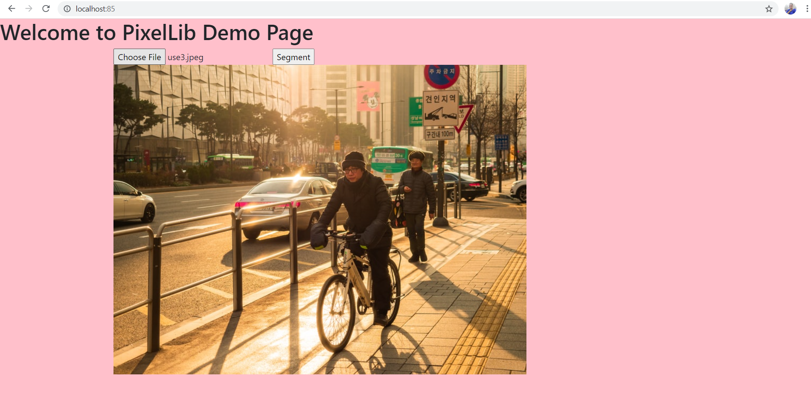
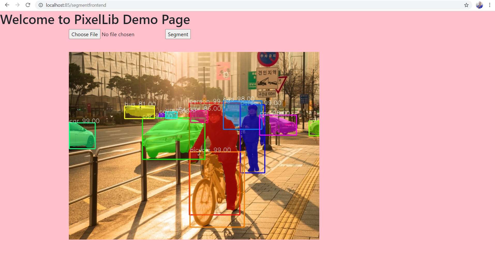

# PixelLib API 
This repository is a collection of codes using docker to deploy a machine learning model as a Rest API for performing image segmentation.
I used docker to build an image segmentation API using PixelLib segmentation library.

## Pull PixelLib API from Dockerhub

```
sudo docker pull ayoolaolafenwa/pixellibapi
```

**Run the API**

```
sudo docker run -p 80:5000 ayoolaolafenwa/pixellibapi
```


<br/>

**Code For API Testing**

``` python
import requests

results = requests.post("http://localhost:85/segmentapi", files = {"image": open("sample.jpeg", "rb")}).json()
print(results["outputs"])
```

**Results**

```
{'boxes': [[372, 158, 528, 504], [530, 163, 605, 374], [1, 219, 81, 299], [374, 309, 542, 542], [227, 204, 420, 332], [477, 151, 596, 239], [589, 195, 703, 257], [742, 213, 774, 259], [376, 181, 429, 218], [172, 167, 264, 206], [279, 190, 294, 200], [299, 185, 334, 205]], 'class_ids': [0, 0, 2, 1, 2, 5, 2, 2, 2, 5, 2, 2], 'class_names': ['person', 'person', 'car', 'bicycle', 'car', 'bus', 'car', 'car', 'car', 'bus', 'car', 'car'], 'mask_shape': [581, 774, 12], 'object_counts': {'bicycle': 1, 'bus': 2, 'car': 7, 'person': 2}, 'scores': [99, 99, 99, 99, 99, 98, 98, 97, 86, 81, 57, 54]}
```

The outputs include a lot of details about the objects detected in the image which include the **box coordinates values**, **class ids**, **class names**, **object counts**, **segmentation mask shape** and **prediction scores**.

**Obtain the segmentation masks**

Obtain the segmentation masks of the objects segmented using this code below;

```python
import requests
import numpy as np

results = requests.post("http://localhost:85/segmentapi", files = {"image": open("sample.jpeg", "rb")}).json()
segmentation_masks = results["mask_values"]
#convert the masks to numpy arrays for proper output format
masks_numpy_array = np.array(segmentation_masks)
print(masks_numpy_array)
```
**Note**: If you print the **results["mask_values"]** directly it will be too long for a proper view format because  the segmentation results by the API is in list.
It is better you convert it to numpy arrays to view the actual segmentation values. 


## Image Segmentation Frontend API 

I provided a simple web API to test on images directly and visualize the results. Visit the port you are running the API e.g *localhost:80* and perform a simple web image segmentation.


<br/>
You can choose any image and press the button segment, it will display an output segmented image within seconds.




## Build A Custom Docker Image

The code for building this API is available in this repository, clone it, make modifications and build your own custom image. 

**Clone Repository**

```
git clone ayoolaolafenwa/pixellibapi

```
Download the [PointRend model](https://github.com/ayoolaolafenwa/PixelLib/releases/download/0.2.0/pointrend_resnet50.pkl) used for image segmentation and put it in the folder directory PixelLibAPI.


**sample folder directory**
```
└── ImageSegmentationAPI
        ├── app.py
        ├── Dockerfile
        ├── pointrend_resnet50.pkl
    
        └── templates
            ├── segment.html

```

**Build Docker Image**

```
cd ImageSegmentationAPI

docker build -t yourimagename
```


